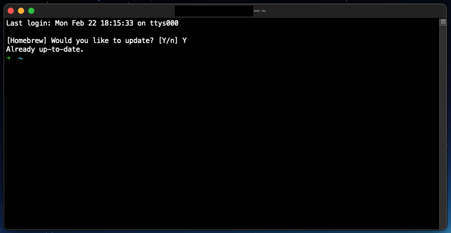

# Homebrew Package Auto-Upgrade Tool



### Setup

1) Add the following lines to your `~/.bashrc`, `~/.zshrc`, etc. file(s):

(**IMPORTANT**: replace `<path>` with the absolute path to this Github project repo)

(`UPDATE_HOMEBREW_DAYS` defaults to 7 days, if unset)

```shell
# ---------
# Homebrew Package Auto-Upgrade Config
# ---------

# Change how often to auto-update Homebrew (in days)
export UPDATE_HOMEBREW_DAYS=7

# Path to Homebrew auto-update installation (Github project repo)
export UPDATE_HOMEBREW_PATH=<path>

# Homebrew auto-update script
source $UPDATE_HOMEBREW_PATH/homebrew-updater.sh
```

This Homebrew package auto-upgrade tool also stores a `.brew-last-update` file in your user's home directory, which
contains a record of when the user was last prompted to run the Homebrew auto-update tool.

#### (Optional)

2) You can edit the `homebrew_updater()` function, at line 14 in `homebrew-updater.sh`, to define your own Homebrew
   package auto-upgrade steps.

### Debug Logger

Each time your `~/.bashrc`, `~/.zshrc`, etc. file(s) are loaded, simple info and warning logs are sent to `debug.log`,
in this Git project repo. 
